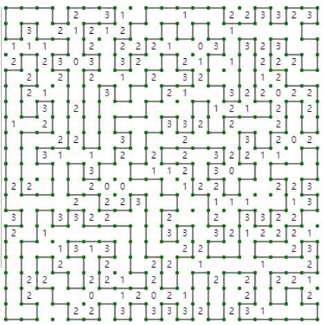
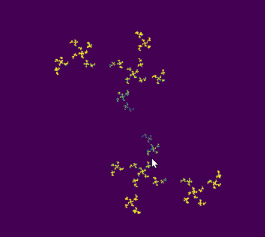
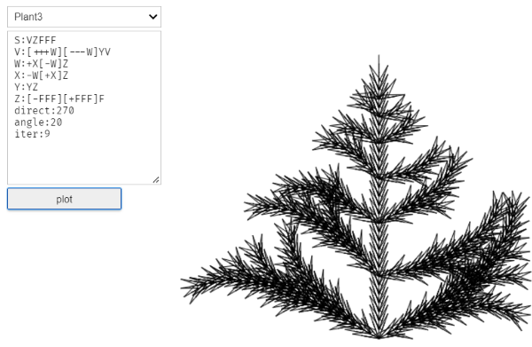
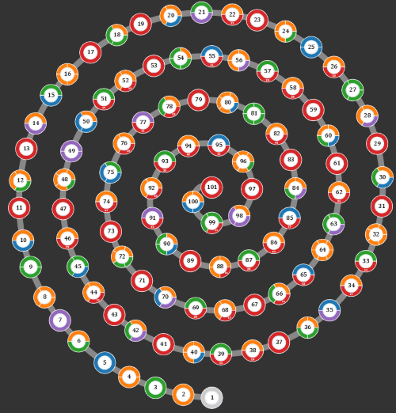
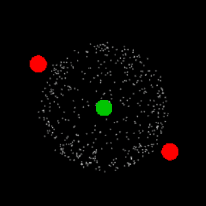
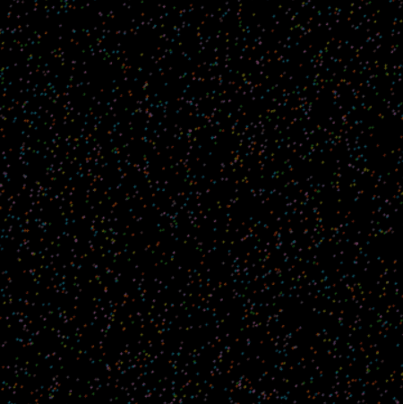

# Demonstration of JupyterLite (A python environment in the browser)

This demo website is a static website that deploys JupyterLite on GitHub Pages. Please use Firefox 90+ or ​​Chromium 89+ browser to open the links below.

**https://ruoyu0088.github.io/jupyterlite_demos/lab/index.html**

If you want to create your own JupyterLite website, please reference the link below:

https://jupyterlite.readthedocs.io/en/latest/quickstart/deploy.html

# Demos

## Solve puzzle games by PySAT

### Sudoku solver

When entering numbers on the Sudoku panel, the solution results are displayed in real time.

https://ruoyu0088.github.io/jupyterlite_demos/lab?path=pysat%2Fsudoku_solver.ipynb

### Shikaku solver

Each number represents the area of ​​the rectangle that contains that number.

https://ruoyu0088.github.io/jupyterlite_demos/lab?path=pysat%2Fshikaku_solver.ipynb

### Nonogram Solver

Nonogram is a logic game that draws black and white bitmaps in a guessing way. In a grid, each row and column has a set of numbers, players need to fill in or leave blanks according to them, and finally draw a picture.

https://ruoyu0088.github.io/jupyterlite_demos/lab?path=pysat%2Fnonogram_solver.ipynb

### Number link solver

Connect the same numbers with horizontal and vertical lines that pass through the centers of all white squares. The lines cannot cross.

https://ruoyu0088.github.io/jupyterlite_demos/lab?path=pysat%2Fnumber_link.ipynb

### Slitherlink solver

Draw a loop connecting adjacent black dots, each number represents the number of four edges in the loop around the square.

https://ruoyu0088.github.io/jupyterlite_demos/lab?path=pysat%2Fslitherlink.ipynb

### 3D Magnet Block Puzzle

Use several Tetris-like shapes to form the specified 3D shape:

https://ruoyu0088.github.io/jupyterlite_demos/lab?path=pysat%2Fmagnetcube.ipynb

## Optimize

### Walking Bionic Beast

Use SciPy's optimization tools and SymPy's symbolic arithmetic capabilities to calculate the walking motion of the Theo Jansen bionic beast.

https://ruoyu0088.github.io/jupyterlite_demos/lab?path=optimize%2Frobot_walk.ipynb

### Solving the Traveling Salesman Problem with the Antcolony Algorithm

Given a series of cities and the distance between each pair of cities, find the shortest circuit that visits each city once and returns to the starting city. This is an NP-hard problem in combinatorial optimization, and this example uses the ant colony algorithm to calculate an approximate optimal solution to the problem.

https://ruoyu0088.github.io/jupyterlite_demos/lab?path=optimize%2Fant-colony-salesman.ipynb

## Drawing

### Julia set

Use cffi to load the WASM file compiled by C language to realize the real-time calculation of the Julia set.

https://ruoyu0088.github.io/jupyterlite_demos/lab?path=plots%2Fjulia_set.ipynb

### L-System

Draws fractal patterns by using string replacement.

https://ruoyu0088.github.io/jupyterlite_demos/lab?path=plots%2Flsystem.ipynb

### Iterative function system

An affine transformation is defined by multiple triangles, and fractal patterns are drawn with random iterations.

https://ruoyu0088.github.io/jupyterlite_demos/lab?path=plots%2Fifs.ipynb

### Roses

Plote rosse flower by using Plotly's 3D plotting function.

https://ruoyu0088.github.io/jupyterlite_demos/lab?path=plots%2Fplots_01.ipynb

### Prime Climb's Board

[Prime Climb](https://mathforlove.com/games/prime-climb/) is an arithmetic game for learning multiplication and factoring. This program uses Bokeh to draw the game's board.

https://ruoyu0088.github.io/jupyterlite_demos/lab?path=plots%2Fprime_climb_draw.ipynb

## Graph Theory

### Klotski Puzzle

Use SciPy's shortest path search algorithm `dijkstra()` to calculate the shortest solution to Klotski puzzle.

https://ruoyu0088.github.io/jupyterlite_demos/lab?path=graph%2Fklotski_solver.ipynb

## Simulation

### Ant Colony

Each ant communicates with other ants through chemicals that emit two odors to carry food home together.

https://ruoyu0088.github.io/jupyterlite_demos/lab?path=simulation%2Fants.ipynb

### Particle life

Apply gravitational and repulsive forces between various particles, and use the equation of motion to calculate the position and velocity of each particle to form interesting motion patterns.

https://ruoyu0088.github.io/jupyterlite_demos/lab?path=simulation%2Fparticle_life.ipynb

## Geometry

### Plane Geometry Script

Plane geometry scripts written using SolveSpace's constrained geometry solver, itcan draw and compute plane geometries quickly.

https://ruoyu0088.github.io/jupyterlite_demos/lab?path=geometry%2Fgeometry_script.ipynb

### Walking Bionic Beast

Use the plane geometry script above to calculate the walking animation of the bionic beast.

https://ruoyu0088.github.io/jupyterlite_demos/lab?path=geometry%2Fstrandbeest_walk.ipynb

## Control

### N-segment pendulum control

Use SymPy to calculate the equation of motion for an N-segment pendulum, linearizing it. Use SciPy to calculate the control gains and simulate the control system of an N-segment pendulum.

https://ruoyu0088.github.io/jupyterlite_demos/lab?path=control%2Fpendulum_control.ipynb

